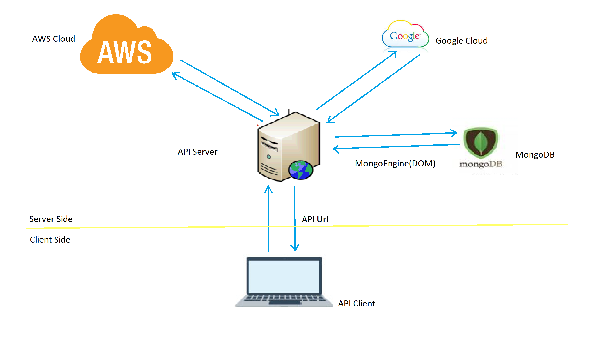
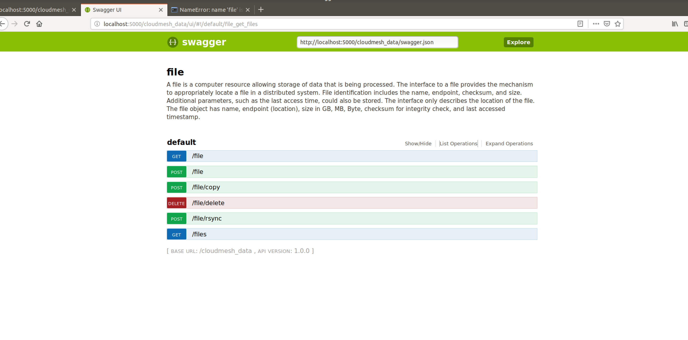

# Manage Files Across Cloud Providers :smiley: fa18-516-18

| Richa Rastogi
| rirastog@iu.edu
| Indiana University
| hid: fa18-516-18
| github: [:cloud:](https://github.com/cloudmesh-community/fa18-516-18/blob/master/project-report/report.md)

---

Keywords: Multi-cloud data service, Cloud Computing, Python, Open API, Cloud Providers, MongoDB, Swagger

---

## Abstract

The goal of this project is to manage files across different cloud providers. There are many cloud providers where we can store data in form of files like Amazon AWS, Microsoft Azure, Google cloud, etc. Here we are going to build an OpenAPI to manage these files, operations like copy, upload, download or delete from any provider. This system is self sufficient to work as a file manager.


## Introduction

The objective of this project is to manage data across different cloud providers. We are going to build an RESTFUL OpenAPI for managing the data between all the cloud storages. We will analyse how these different clouds work and then build python methods to handle data across them. Final step will be to expose these functionalities as a RESTFUL API. This way we can also take advantage of cloud providers for cheaper solutions for storage by dividing the data across them. Since this project has its own MongoDB and User profiling so it can be used a file manager in itself.

## Requirements

This project requires knowledge about Cloud Providers like AWS, Azure, Google Cloud, etc. 
* This project is using Amazon AWS and Google cloud as two cloud providers and their storage functionality. We can expand this 
* This also needs a database so we are using MongoDB through MongoEngine and store the files and User data in it.
* Overall functionality can be accesses through console or RESTFUL OpenAPI which is built using Flask and Swagger.

## Architecture

Please refer to below diagram #fig:Architecture for architecture of this project.

{#fig:Architecture}

## Design

This project involves developing a RESTFUL API to manage files. We can perform following operations like upload, download, list, copy, rsync and delete. We can also this project to store files in MongoDB and assign specific User Role permissions to access the files. 

* The very first thing required for that is to create accounts in AWS and Google(Since those are the two providers we are using). 
* Then use their API Keys to connect to these providers through Python code. 
* After we have a connection, we use their APIs to access the bucket by providing the name through Yaml file/API input.
* Now since we have the bucket, we can list, download or upload the files.
* There is Command console from where we can execute these functions directly using console or script file.
* On top of that there is an open API built to perform these functions using REST.
* We also have MongoDB storing the downloaded files.

## Implementation

This project is using following technologies for implementation:
* Python 3.7.0 for python code development
* Swagger 2.0 for writing API specification. This specification describes REST endpoints for managing files across providers.
* Python flask framework which consumes the OpenAPI specification and directs the endpoints to Python functions by building a RESTful app.
* MongoEngine as a Document-Object Mapper for working with MongoDB from Python.

Enable a virtual environment so that all installations can be done specifically in that env.
```
python3 -m virtualenv /home/richa/venv/    //to install venv
source /home/richa/venv/bin/activate		//to activate venv

Now my console looks like:

(venv) (3.7.0) richa@richa-VirtualBox:~$
```

### AWS access from Python:
* Install apache-libcloud by "pip install apache-libcloud"
* Follow instructions to create an AWS account - https://github.com/cloudmesh-community/book/blob/master/chapters/iaas/aws/aws.md
* Select S3 from Services and create a bucket
* To access this bucket, go to IAM and create a user and then create a new Access Key in "Security Credentials"
* While creating this key, system will promt to download pem file. Save that pem file onto your working machine.

### Google Cloud Platform:
* Install "pip install google-cloud-storage"
* pip install google-auth google-auth-httplib2
* pip install --upgrade google-api-python-client
* Create an account on Google Cloud by going to https://cloud.google.com/
* Create a new Project from the top of the page.
* Create a new storage bucket in google cloud, select Storage -> Storage -> Browser
* To access this bucket now, follow https://cloud.google.com/storage/docs/reference/libraries
* This will download a JSON file in your working VM and use that file for authentication to access Google Cloud Storage.

All the dependencies can be installed easily by running requirements.txt inside project-code so no need to do any pip install.

```bash
 pip install -r requirements.txt
```

AWS and Google Cloud specific functionality python files are under directory structure project-code/cloudmesh/data. cloudmesh-data.yaml is the yaml file holding all the information about these cloud setup. Aws_setup.py and google_cloud_setup.py uses this yaml file to authenticate the cloud providers and setup the connection to the cloud services.

It also has command.py under here to run the functionality from console passing in relevant input.
To execute commands from console using cmdata commands, we need to setup cmdata by running in project-code dir:
```bash
 pip install .
```
Now we can run all cmdata commands as given below. We can also test if cmdata is working by running a test command:
```
 cmdata test
```

```
Usage:
  cmdata data list [--format=FORMAT]
  cmdata set provider=PROVIDER
  cmdata set dir=BUCKET
  cmdata data add PROVIDER FILENAME
  cmdata data get PROVIDER FILENAME USER_UUID
  cmdata data ls PROVIDER
  cmdata data copy FILENAME PROVIDER DEST
  cmdata data rsync FILENAME SOURCE DEST
  cmdata data del PROVIDER FILENAME
  cmdata update user USER file FILENAME
  cmdata (-h | --help)
  cmdata --version

Options:
  -h --help     Show this screen.
  --version     Show version.
  --config      Location of a cmdata.yaml file

Description:

    cmdata data ls PROVIDER

        Description: CM command to list all the files in a Provider's bucket

    cmdata data add PROVIDER FILENAME

        Description: CM command to upload a file from local directory to the Provider's bucket

    cmdata data get PROVIDER FILENAME USER_UUID

        Description: CM command to download a file from the Provider's bucket to a local directory
        and then save that file to MongoDB with the username assigned

    cmdata data copy FILENAME PROVIDER DEST

        Description: CM command to copy a file from one Provider's bucket to another

    cmdata data del PROVIDER FILENAME

        Description: CM command to delete a file from a Provider's bucket

Example:
   cmdata data ls google_cloud
   cmdata data add google_cloud abc.txt
   cmdata data get google_cloud abc.txt richa
   cmdata data copy xyz.txt AWS GOOGLE
   cmdata data del google_cloud abc.txt
   
```

We also have MongoDB installed to save the downloaded files into the database. We are using MongoEngine as Document-Object Mapper to add records and save the file as a FileField into DB. File is stored into MongoDB using GridFS.

### MongoEngine GridFS
GridFS is a specification for storing and retrieving files into MongoDB.

Instead of storing a file in a single document, GridFS divides the file into parts, or chunks, and stores each chunk as a separate document. By default, GridFS uses a default chunk size of 255 kB; that is, GridFS divides a file into chunks of 255 kB with the exception of the last chunk. The last chunk is only as large as necessary. Similarly, files that are no larger than the chunk size only have a final chunk, using only as much space as needed plus some additional metadata.

GridFS uses two collections to store files. One collection stores the file chunks, and the other stores file metadata. The section GridFS Collections describes each collection in detail.

When you query GridFS for a file, the driver will reassemble the chunks as needed. You can perform range queries on files stored through GridFS. You can also access information from arbitrary sections of files, such as to “skip” to the middle of a video or audio file.

GridFS is useful not only for storing files that exceed 16 MB but also for storing any files for which you want access without having to load the entire file into memory. See also When to Use GridFS.

This File database table structure is read from project-code/file.yml definitions and it has a primary key as the name of the file so that we can search based on this field. This also has user_uuid field to provide specific user access to the files.

```
class File(Document):
    name = StringField(primary_key=True)
    endpoint = StringField()
    checksum = StringField()
    size = StringField()
    timestamp = DateTimeField(default=datetime.datetime.now)
    last_modified = DateTimeField(default=datetime.datetime.now)
    user_uuid = StringField()
    file_content = FileField()
```

Similarly we have a User table to store Users with their roles and group.


This project also has RESTFUL APIs to perform all the above operations and their Swagger UI looks like below. For File APIs, please refer to screenshot below for Swagger UI for File APIs (refer to FileSwaggerAPI.png).


{#fig:FileSwaggerAPI}

|  API Path                  | Type     | Description                           | Input Parameters                  |
| ----------------           | -------- | ------------------------------------- | ----------------------------------|
| /cloudmesh/files?service={provider}| GET      | Returns all files from a specific provider  | Query Param: Provider name  
| /cloudmesh/file?service={provider}&filename={filename}&user_uuid={user} | GET      | Returns a file for a specifc provider       | Query Param: Provider Name, filename, user_uuid
| /cloudmesh/file?service={provider}&filename={filename} | POST    | Upload a file to a provider   | Query Param: Provider name,filename
| /cloudmesh/file/copy?service={provider}&filename={filename}&dest={destination}     | POST    | Copy a file to a provider     | Query Param: Filename, Provider, destination
| /cloudmesh/file/rsync?service={provider}&filename={filename}&dest={destination}    | POST    | Rsync a file to another directory | Query Param: Filename, Provider, destination
| /cloudmesh/file/delete?service={provider}&filename={filename}     | DELETE  | Delete a file from a directory    | Query Param: Filename, Provider


For User APIs, please refer to screenshot below for Swagger UI for User APIs (refer to UserSwaggerAPI.png).

{#fig:UserSwaggerAPI}

|  API Path                  | Type     | Description                           | Input Parameters                  |
| ----------------           | -------- | ------------------------------------- | ----------------------------------|
| /cloudmesh/user/profile    | GET      | Returns all profiles                  | NONE
| /cloudmesh/user/profile    | PUT      | Create a new profile                  | Body: Profile Object
| /cloudmesh/user/profile/{uuid} | GET  | Returns the profile of a user while looking it up with the UUID | Path Param: UUID

## Dataset

Database records for File table. This shows that file_content is stored in another table as per GridFS described above in fs.chunks and 
fs.files:
```
{'_id': 'MapReduce.docx', 'endpoint': 'AWS', 'checksum': '2c716d77f0916df41147f16c05c91e10', 'size': '149.5 KB', 'timestamp': datetime.datetime(2018, 12, 2, 14, 45, 32, 564000), 'last_modified': datetime.datetime(2018, 12, 2, 14, 45, 32, 564000), 'user_uuid': 'richa', 'file_content': ObjectId('5c04608cf8724304b52eac8a')}
{'_id': 'aws_lambda.png', 'endpoint': 'AWS', 'checksum': 'a73e3d8449ab6e7366a7b1e7f24dab35', 'size': '99.6 KB', 'timestamp': datetime.datetime(2018, 12, 2, 14, 46, 9, 241000), 'last_modified': datetime.datetime(2018, 12, 2, 14, 46, 9, 241000), 'user_uuid': 'richa', 'file_content': ObjectId('5c0460b1f87243053dd214de')}
```

Database records for User table.
```
{'_id': '11111', 'username': 'richa.rastogi', 'group': 'test', 'role': 'test', 'resource': 'test', 'context': 'test', 'description': 'test', 'firstname': 'richa', 'lastname': 'rastogi', 'publickey': 'test', 'email': 'rrastogi@iu.edu'}

```

## Conclusion

The main objective of this project was to gain knowledge and understanding of different cloud providers and create RESTFUL APIs using OpenAPI architecture using either flask or Eve and then to use MongoDB database to manage this data coming in from cloud providers. There were several other technologies been used to bring this whole project together.

This project can be enhanced even further by including many other cloud providers like Openstack, Azure etc. and all these clouds can perform operations within themselves which can reduce costs for certain people since they will not be exceedingly dependent on only just one provider. 
Since this project has its own access and database system enabled so this can be used as a file manager in itself.

## Acknowledgement

I am very thankful to Professor Gregor von Laszewski for helping me throughout this project development as I am new to all the technologies used in this project. I also took help from nist and cm projects to understand the OpenAPI development using flask.

## References

* [@cloudmesh-nist-services] https://github.com/cloudmesh-community/nist/tree/master/services
* [@cloudmesh-cm] https://github.com/cloudmesh-community/cm/tree/master/cm4
